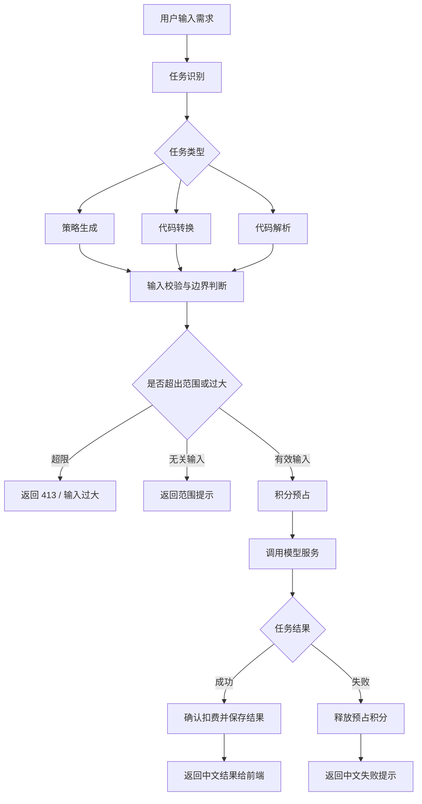

# LightQuant 量化策略助手

LightQuant 是一个面向量化策略开发者的 AI 助手产品，目标是降低策略生成、代码转换和代码解析的使用门槛，让用户可以用更自然的方式完成量化平台相关工作。

本公开仓库仅用于项目介绍与产品展示，不包含业务源码、数据库连接信息、密钥、私有实现或生产配置。

## 项目介绍

LightQuant 当前 MVP 聚焦三类核心任务：

- 策略生成：根据用户描述生成可进一步修改和验证的量化策略草稿。
- 代码转换：辅助不同量化平台之间的策略代码迁移，例如向 ptrade 方向转换。
- 代码解析：对已有策略代码进行结构说明、风险提示和优化建议。

产品同时规划了积分体系，用于记录 AI 任务消耗、充值、流水和任务状态，为后续真实 LLM 调用、支付接入和用户增长打基础。

## 产品截图

### 首页

### 对话页

### 代码解析页

### 更多功能页

### 积分流水页

## Agent 工作流图

## 技术栈说明

- 前端框架：Next.js、React、TypeScript
- 样式系统：Tailwind CSS
- 后端形态：Next.js API Routes
- 数据库方向：PostgreSQL，开发阶段使用 Supabase 验证真实数据库落地
- 业务模块：用户会话、积分账户、积分流水、AI 任务、任务结果、充值订单
- 工程策略：源码私有管理，公开仓库仅展示产品信息

## 未来接入 MiMo 的计划

LightQuant 后续计划将 MiMo 纳入模型接入候选，用于量化策略相关 Agent 能力验证。

计划方向：

- 抽象统一的 LLM Provider 接口，保持 OpenAI、DeepSeek、DashScope、MiMo 等模型可切换。
- 为三类任务分别完善 Prompt、Skill 和边界策略。
- 建立小型评测集，覆盖策略生成、代码转换和代码解析的常见场景。
- 对模型输出进行中文化、结构化和安全边界处理。
- 将模型调用与积分预占、确认扣费、失败释放流程打通。
- 在真实用户量和调用成本明确后，再决定 MiMo 的生产接入方式。

## 当前状态

项目仍处于 MVP 建设阶段，当前重点是产品闭环、真实数据库落地、AI 任务基础设施和后续模型接入验证。
