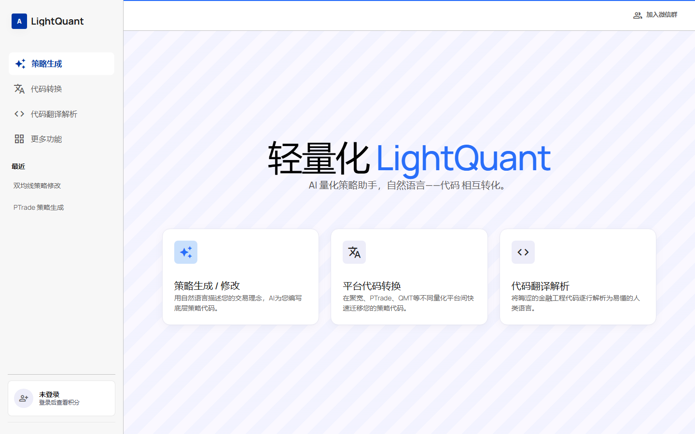
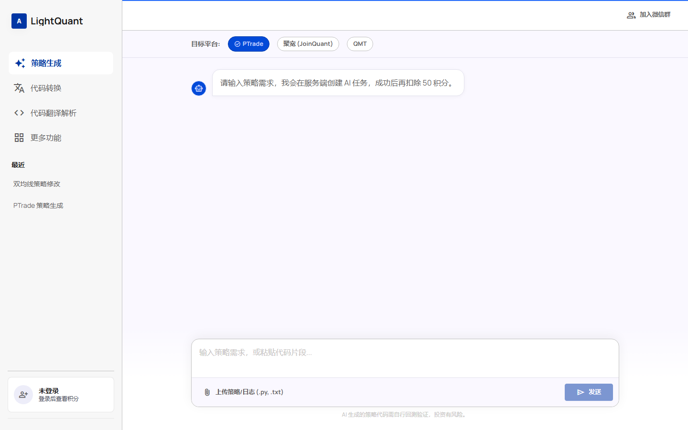
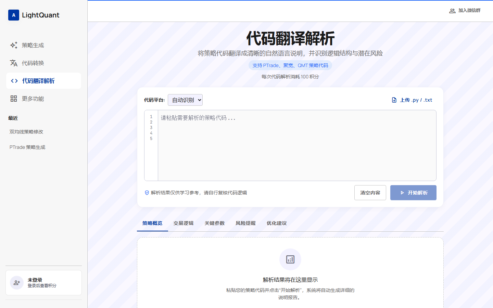
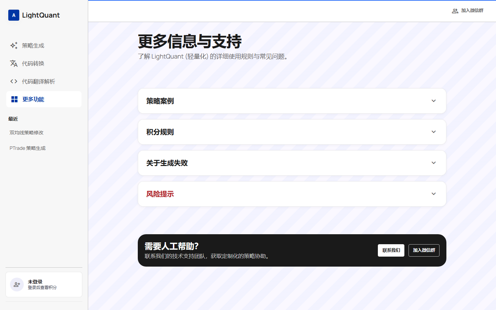
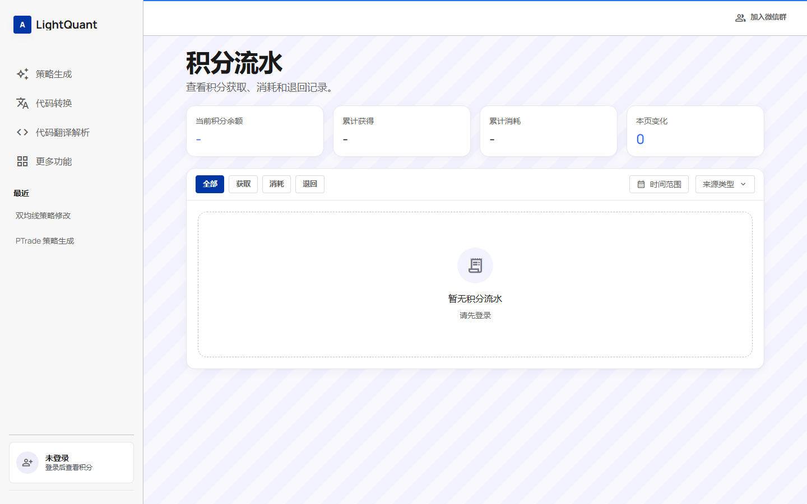
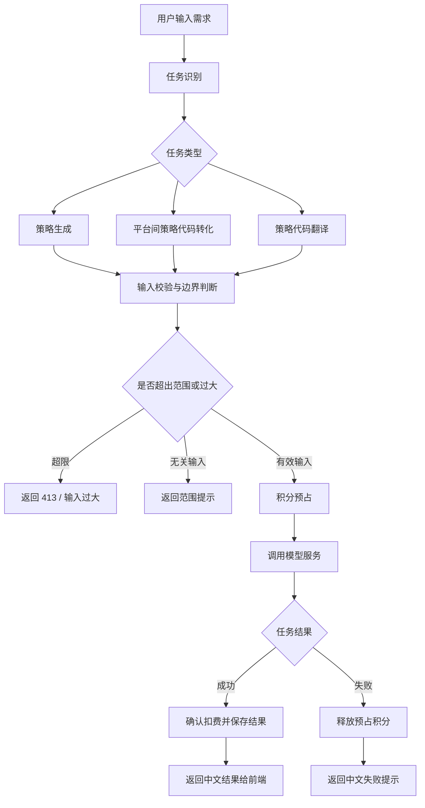

# LightQuant 量化策略助手

LightQuant 是一个面向不同量化平台研究者的网站，帮助用户用自然语言生成量化策略、在平台之间进行策略代码相互转化，并将策略代码翻译成易理解的自然语言说明。产品也面向零代码基础的使用者，希望让更多人能够用更低门槛参与策略研究、策略迁移和策略理解。

本公开仓库仅用于项目介绍与产品展示，不包含业务源码、数据库连接信息、密钥、私有实现或生产配置。

## 项目介绍

LightQuant 当前聚焦三类核心任务：

- 策略生成：根据自然语言描述生成可进一步修改和验证的量化策略草稿。
- 平台间策略代码转化：辅助不同量化平台之间的策略代码迁移，例如聚宽、ptrade、QMT 等平台之间的转换。
- 策略代码翻译：将已有策略代码解析成自然语言，帮助用户理解代码结构、交易逻辑、风险点和可优化方向。

产品同时规划了积分体系，用于记录 AI 任务消耗、充值、流水和任务状态，为后续真实模型调用、支付接入和用户增长打基础。

## 产品截图

以下截图来自当前开发版本，按真实运行页面重新截取。

### 首页

### 对话页

### 代码解析页

### 更多功能页

### 积分流水页

## Agent 工作流图

## 技术栈说明

- 前端框架：Next.js、React、TypeScript
- 样式系统：Tailwind CSS
- 后端形态：Next.js API Routes
- 数据库方向：PostgreSQL，开发阶段使用 Supabase 验证真实数据库落地
- 业务模块：用户会话、积分账户、积分流水、AI 任务、任务结果、充值订单
- 工程策略：源码私有管理，公开仓库仅展示产品信息

## 当前状态

开发中。
